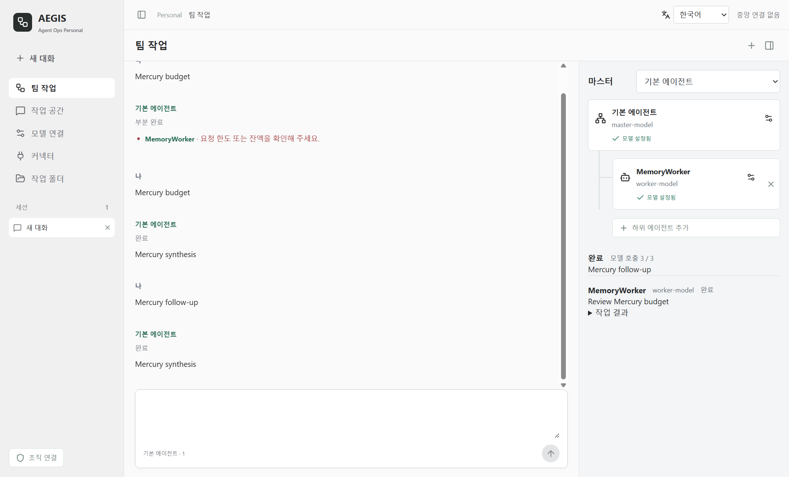
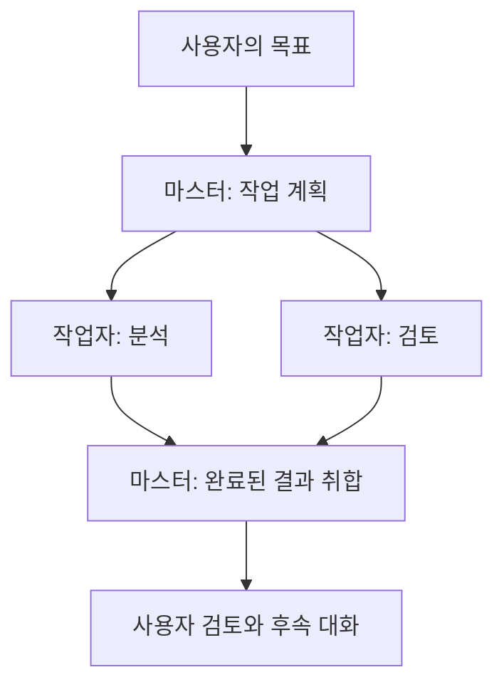
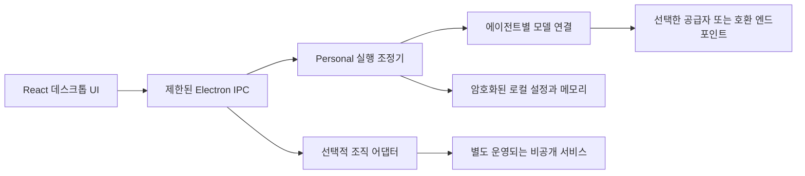

# AEGIS Agent Ops Personal

[](https://github.com/aegisintelmetry/agent-ops-public-preview/actions/workflows/desktop-checks.yml)
[](LICENSE)

**내 모델로 구성하는 에이전트 팀, 직접 선택하는 메모리.**

[English](README.md) | [Windows 다운로드](https://github.com/aegisintelmetry/agent-ops-public-preview/releases/tag/v0.5.10-preview) | [보안 신고](SECURITY.md)

여러 언어 모델과 대화하고, 텍스트 작업을 에이전트 팀으로 나누고, 필요한 기억을 직접 관리하는 **AEGIS의 오픈소스 데스크톱 프로젝트**입니다.

**AEGIS의 중심은 Security FDE입니다.** Personal은 우리가 공개적으로 개발하는 프로젝트이며, 기업용 보안 제품이나 Security FDE 서비스의 대체재가 아닙니다. 개인 사용과 피드백을 환영합니다. 기업 연동은 실제 사용자에게서 적용 수요가 확인될 때 검토하며, Personal 사용에 기업 계약이나 조직 계정은 필요하지 않습니다.



*자동 UI 시험에서 촬영한 실제 앱 화면입니다. 이름·모델 ID·응답과 한도 오류는 합성 테스트 데이터이며, 실제 공급자 응답이나 성능 측정 결과가 아닙니다.*

## 목차

- [현재 가능한 작업](#현재-가능한-작업)
- [설치와 시작](#설치와-시작)
- [첫 팀 구성하기](#첫-팀-구성하기)
- [활용 예시](#활용-예시)
- [모델 연결](#모델-연결)
- [직접 관리하는 메모리](#직접-관리하는-메모리)
- [데이터와 권한](#데이터와-권한)
- [구조와 소스 안내](#구조와-소스-안내)
- [현재 제한](#현재-제한)
- [문제 해결과 FAQ](#문제-해결과-faq)
- [개발과 기여](#개발과-기여)
- [문서와 다음 단계](#문서와-다음-단계)
- [이력과 공개 범위](#이력과-공개-범위)
- [보안과 라이선스](#보안과-라이선스)

## 현재 가능한 작업

- 에이전트마다 모델 연결을 선택하고 별도 대화 유지
- 마스터와 작업자 1~4명을 트리로 구성하고 텍스트 작업 분담·응답 취합
- 최대 2개 작업자 병렬 실행, 후속 팀 대화, 진행 확인과 명시적 재시도
- 역할 프롬프트와 공통·팀·에이전트 전용 메모리의 수동 저장·활성화
- 한국어·영어 인터페이스 전환
- Slack 인증 확인과 공개 채널 목록 조회용 읽기 전용 샘플 커넥터

예를 들어 한 작업자가 제안서를 분석하고 다른 작업자가 가정을 비판한 뒤, 마스터가 응답을 정리할 수 있습니다. 이는 모델의 텍스트 지원이며 결과의 사실성을 독립적으로 검증하는 기능은 아닙니다.

## 설치와 시작

1. [릴리스 페이지](https://github.com/aegisintelmetry/agent-ops-public-preview/releases/tag/v0.5.10-preview)에서 `AEGIS-Agent-Ops-Setup-0.5.10-preview.exe`를 내려받습니다.
2. Windows x64에 설치하고 **Personal**을 선택합니다.
3. 에이전트의 모델 연결을 설정한 뒤 대화하거나 팀을 구성합니다.

설치본은 로컬 코어를 포함하므로 실행을 위해 Python·Node를 별도로 설치할 필요는 없습니다. Codex 연결에는 별도의 Codex CLI 또는 VS Code Codex 확장이 필요합니다.

**미서명 프리뷰입니다.** 중요한 업무나 민감한 정보에 사용하기 전에 아래 제한을 확인해 주세요.

현재 배포 대상은 Windows x64입니다. macOS·Linux 설치본은 제공하거나 검증하지 않았습니다. Personal에는 중앙 MCP 서버, 조직 등록, AEGIS 구독이 필요하지 않습니다. 사용 가능한 모델 연결은 직접 준비해야 하며 공급자 이용료는 앱에 포함되지 않습니다.

## 첫 팀 구성하기

1. **작업 공간**에서 기본 에이전트를 선택하고 **모델 연결**에서 공급자·인증·모델을 설정합니다.
2. 민감하지 않은 짧은 메시지로 연결을 확인합니다. 설정 저장만으로 모델 접근 권한이나 잔액이 검증되지는 않습니다.
3. **팀 작업**에서 마스터를 선택하고 트리에 작업자 1~4명을 추가합니다.
4. 참여 에이전트 각각의 모델 연결을 설정합니다. 서로 다른 공급자와 모델을 사용할 수 있으며 새 에이전트에 기존 인증 정보를 자동 복사하지 않습니다.
5. 분석가·검토자처럼 역할을 구체적으로 정합니다. 요청에 포함할 맥락이 있을 때만 메모리를 추가합니다.
6. 팀 대화창에 목표를 입력하고 확인 절차를 거쳐 실행합니다. 최종 응답뿐 아니라 개별 작업자의 결과도 확인합니다.
7. 후속 요청을 보내거나 미완료 작업을 명시적으로 재시도합니다. 작업 맥락이 달라지면 새 대화를 시작합니다.



작업자는 최대 2명까지 동시에 요청합니다. 4명 팀은 계획 1회, 작업자 4회, 취합 1회로 최대 6회의 모델 호출을 할 수 있습니다. 작업자가 실패하면 성공 요약 대신 부분 완료로 표시합니다. 재시도는 사용자 요청으로 수행하며 무한 백그라운드 반복이 아닙니다.

에이전트는 하나의 앱 조정기가 관리하는 로컬 설정입니다. 에이전트마다 별도 PC 러너를 설치하지 않습니다. 실행 완료는 요청 흐름의 완료이지 답변의 사실성을 인증한다는 뜻이 아닙니다.

## 활용 예시

| 작업 | 역할 구성 | 사용자가 제공할 내용 |
| --- | --- | --- |
| 제안서 검토 | 분석가 + 비판적 검토자 | 제안서 본문, 제약, 평가 기준 |
| 대안 비교 | 장단점 분석가 + 위험 검토자 | 비교할 선택지와 근거 자료 |
| 문서 개선 | 편집자 + 일관성 검토자 | 초안과 독자 대상 |
| 의사결정 요약 | 요약자 + 가정 검토자 | 메모와 해결할 질문 |

요청 예시:

> 아래 제안서를 검토해 줘. 한 작업자는 기대 효과를 정리하고, 다른 작업자는 근거가 부족한 가정을 찾아 줘. 제공된 사실과 제안을 구분해서 짧은 의사결정 요약으로 합쳐 줘. 없는 근거는 만들지 마.

앱이 웹에서 근거를 검색하거나 임의의 파일을 읽거나 생성된 명령을 실행하지는 않습니다. 필요한 텍스트를 직접 제공하고 결과를 검토해 주세요.

## 모델 연결

| 연결 | 현재 지원 |
| --- | --- |
| OpenAI·DeepSeek·Kimi·Gemini | 사용자가 입력한 API 키 |
| OpenAI 호환·로컬 모델 | 직접 지정한 주소와 모델 |
| ChatGPT / Codex | 기존 에이전트별 Codex 로그인 연결 |
| Gemini API OAuth | 공유 Google 계정 연결, 사용자 소유 Desktop OAuth 클라이언트 필요 |

공급자별 API 요금과 사용 한도가 적용됩니다. 채팅 구독과 API는 같은 권한이 아닙니다. Gemini OAuth는 웹 구독이 아니라 Google Cloud 프로젝트의 API 권한과 사용량을 사용합니다. [Google 연결 안내](docs/personal-google-accounts.md)를 참고하세요.

## 직접 관리하는 메모리

메모리는 직접 저장한 맥락이며 모든 대화에서 자동으로 학습하는 기능이 아닙니다.

| 맥락 | 용도 | 적용 범위 |
| --- | --- | --- |
| 역할 프롬프트 | 담당 업무와 응답 방식 | 해당 에이전트의 요청 |
| 공통 메모리 | 여러 에이전트가 참고할 선호·기준 | 활성화된 관련 요청 |
| 팀 메모리 | 공동 작업에 필요한 맥락 | 팀 실행에 적용, 일반 개인 대화에는 미적용 |
| 에이전트 메모리 | 특정 에이전트만 참고할 내용 | 해당 에이전트의 요청 |

기록은 직접 관리하고 활성화해야 합니다. 키워드 관련도를 기준으로 최대 3개 기록을 역할 프롬프트와 함께 적용합니다. 벡터 DB, 대화 자동 수집, 클라우드 메모리 동기화는 없습니다.

저장한 프롬프트와 메모리는 로컬 암호화 저장소에 유지되지만 일반 대화는 종료 후 복원되지 않습니다. 메모리에 비밀값을 넣지 마세요. 적용되는 기록은 모델 요청에 포함되고 작업자 응답을 통해 마스터에게 전달될 수 있습니다.

## 데이터와 권한

인증 정보와 저장된 프롬프트·메모리는 OS 암호화 저장소를 사용합니다. 대화 기록은 실행 중 메모리에만 유지되며 앱 종료 후 복원되지 않습니다.

선택한 공급자에는 대화와 적용되는 활성 메모리·역할 프롬프트가 전달됩니다. 팀의 목표와 작업자 결과는 마스터와 공유됩니다. 에이전트 전용 메모리를 다른 에이전트에 원문으로 복사하지는 않지만 생성된 결과에 내용이 반영될 수 있습니다.

로컬 저장이 곧 오프라인 추론을 뜻하지는 않습니다. 민감한 정보를 보내기 전에 선택한 공급자와 사용 조건을 확인하세요.

## 구조와 소스 안내



Personal 모델 요청은 Electron 측 어댑터가 처리합니다. 패키지의 Python 코어는 별도 로컬 브리지와 조직 연동을 지원하며, 에이전트를 추가할 때마다 Python 서비스를 만들지 않습니다.

| 소스 | 담당 기능 |
| --- | --- |
| `apps/desktop/src/` | React 화면 |
| `apps/desktop/electron/agents.cjs` | 에이전트 식별과 설정 분리 |
| `apps/desktop/electron/team.cjs` | 계획·작업자 실행·재시도·취합 |
| `apps/desktop/electron/knowledge.cjs` | 역할 프롬프트와 범위별 메모리 |
| `apps/desktop/electron/personal.cjs` | API 기반 대화 |
| `apps/desktop/electron/codex.cjs` | Codex 연결 어댑터 |
| `apps/desktop/electron/google-accounts.cjs` | 공유 Google OAuth 연결 |
| `agent_ops/` | 클라이언트·코어와 선택적 조직 브리지 |
| `apps/desktop/tests/`, `tests/desktop/` | Node·Electron UI·Python 검증 |

공개 클라이언트는 운영 하네스나 비공개 Security FDE 플랫폼의 독립 배포본이 아닙니다. [모듈 경계](docs/core-boundary.md)를 참고하세요.

## 현재 제한

- 일반 파일 접근, 셸 명령 실행, 자율적인 도구 실행은 지원하지 않습니다.
- 메모리는 수동·키워드 기반이며 자동 학습, 임베딩, 클라우드 동기화는 없습니다.
- Slack 샘플은 메시지 전송이나 Slack을 통한 업무 배정을 하지 않습니다.
- 실제 Google OAuth 로그인·추론과 새 PC 설치는 자동화된 모의 시험 외에 추가 검증이 필요합니다.
- 기업 보안 보장, 규정 준수 인증, 응답 시간 SLA, 장기 지원을 약속하지 않습니다.
- 조직 연결 어댑터는 있지만 비공개 중앙 서버와 운영 러너 전체는 포함하지 않습니다. Personal에는 이들이 필요하지 않습니다.

자동 테스트는 로컬 동작·격리·UI·패키징을 검증합니다. 모델 정확도나 모든 공급자·계정 조합의 작동을 증명하지는 않습니다.

## 문제 해결과 FAQ

| 증상 | 확인 사항 |
| --- | --- |
| 참여 에이전트의 모델 연결 오류 | 현재 대화 에이전트뿐 아니라 마스터와 선택한 작업자 모두 설정했는지 확인 |
| HTTP 429·한도 메시지 | 공급자 계정·API 잔액·요청 제한·모델 접근 권한 확인. 반복 재시도는 추가 사용량을 발생시킬 수 있음 |
| 로그인은 되지만 추론 실패 | 인증 성공과 API 이용 권한·프로젝트 설정·모델 접근 가능 여부는 별개 |
| 팀 작업 부분 완료 | 실패한 작업자와 연결을 확인한 뒤 명시적으로 재시도. 완료 결과로 취급하지 않음 |
| 메모리가 적용되지 않음 | 활성화 여부·범위·키워드 관련도 확인 |
| 재시작 후 대화가 사라짐 | 대화 영속 저장은 미구현. 설정·저장 메모리와 별개 |
| Slack 메시지 전송 불가 | 샘플은 인증과 공개 채널 목록 조회만 지원하는 읽기 전용 |

**무료인가요?** 소스는 Apache-2.0으로 공개합니다. 모델 공급자의 추론 요금은 별도이며 무료 크레딧을 제공하지 않습니다.

**작업자마다 유료 계정이 필요한가요?** 각자 사용 가능한 모델 연결이 필요하지만 반드시 서로 다른 계정이어야 하는 것은 아닙니다. 인증 방식·동시성·사용량 제한은 공급자에 따릅니다. Google 연결은 공유할 수 있고 Codex 연결은 에이전트별로 설정합니다.

**완전 오프라인인가요?** 적절한 로컬 호환 추론 서버를 직접 선택했을 때만 가능합니다. 클라우드 공급자를 선택하면 해당 공급자에 요청을 보냅니다.

**제거하면 데이터도 모두 지워지나요?** Windows 제거 프로그램은 앱 데이터를 유지합니다. 앱 삭제를 공급자 인증 폐기나 저장 설정 삭제와 동일하게 보지 마세요.

## 개발과 기여

Windows, Node.js 22.12 이상, 코어 개발·검증용 Python 3.12를 준비합니다.

```powershell
python -m pip install -r apps/desktop/build-requirements.txt
python -m unittest discover -s tests/desktop
cd apps/desktop
npm ci
npm test
npm run build
npm run test:desktop
npm start
```

설치본 빌드는 저장소 루트에서 실행합니다.

```powershell
powershell -NoProfile -File apps/desktop/build-windows.ps1
```

버그 재현, 작은 범위의 개선 PR, 실제로 유용했던 작업 사례를 환영합니다. [기여 안내](CONTRIBUTING.md)와 [Windows CI](https://github.com/aegisintelmetry/agent-ops-public-preview/actions/workflows/desktop-checks.yml)를 참고하세요.

## 문서와 다음 단계

| 안내 | 범위 |
| --- | --- |
| [English introduction](README.md) | 영문 설치·사용·구조 안내 |
| [Google 연결](docs/personal-google-accounts.md) | Desktop OAuth 설정과 인증 정보 경계 |
| [모듈 경계](docs/core-boundary.md) | 공개 제품과 비공개 운영의 구분 |
| [기여 안내](CONTRIBUTING.md) | 개발과 안전한 이슈·PR 작성 |
| [릴리스 점검](docs/public-release.md) | 프리뷰 검증과 남은 운영 확인 |
| [공개 이력](docs/public-history.md) | 제품 이력을 선별한 이유 |
| [보안 정책](SECURITY.md) | 비공개 취약점 신고 |

우선 검증 대상은 새 PC 설치와 실제 공급자·계정 연결이며, 특히 Google OAuth의 실제 사용 흐름을 확인해야 합니다. 대화 영속 저장·커넥터 확장·도구 실행은 이후 검토할 수 있는 방향이지 **이번 프리뷰의 제공 기능이나 출시 일정 약속이 아닙니다.** 외부 쓰기 작업을 허용하기 전에 권한과 데이터 전달 경계를 설계해야 합니다.

`docs/`의 이전 구현 기록은 각각의 개발 단계를 설명합니다. 현재 프리뷰의 범위는 이 README를 기준으로 하며 과거 시험 개수나 잔여 작업 목록은 현재 지원표가 아닙니다.

## 이력과 공개 범위

공식 배포 주체는 **aegisintelmetry**입니다. 공개 시작점·설치 파일 해시·서명 한계는 [출처와 배포 검증](docs/provenance.ko.md), 포크와 공식 배포 구분은 [프로젝트 식별 안내](BRANDING.md)를 참고하세요.

이 저장소는 라이선스를 적용한 0.5.4 제품 스냅샷을 시작점으로 **공개 가능한 제품 개발 이력을 선별**했습니다. 초기 비공개 운영 코드와 그 Git 이력은 포함하지 않습니다. 이후 제품 개선의 원래 작성자와 변경 설명은 유지했습니다. [이력 방침](docs/public-history.md)을 공개합니다.

`apps/desktop`, `agent_ops` 클라이언트·코어, 테스트가 공개 대상입니다. 비공개 Security FDE 서비스 구현, 중앙 서버, 운영 하네스는 공개하지 않습니다. `BTK_*` 식별자는 기존 설정 호환용이며 내부 시스템 접근 권한을 제공하지 않습니다.

## 보안과 라이선스

취약점은 공개 이슈 대신 **contact@aegistelemetry.com**으로 비공개 신고해 주세요. 키·토큰·개인 대화를 첨부하지 마세요. [보안 정책](SECURITY.md)을 확인하세요.

[Apache-2.0](LICENSE), Copyright (c) 2026 aegisintelmetry. 제3자 구성요소는 각자의 라이선스를 따르며 [NOTICE](NOTICE)와 설치본 고지에 포함합니다. 이 저장소 밖 비공개 서비스에는 이 라이선스가 적용되지 않습니다.
