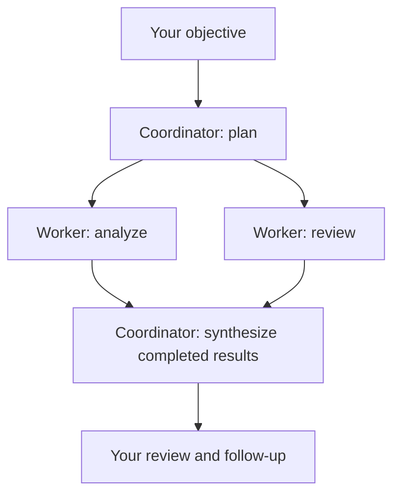
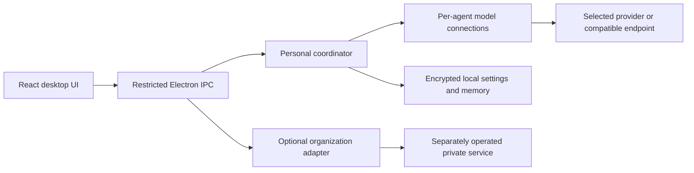

# AEGIS Agent Ops Personal

[](https://github.com/aegisintelmetry/agent-ops-personal/actions/workflows/desktop-checks.yml)
[](LICENSE)

**Your models. A visible agent team. Memory you choose.**

[한국어](README.ko.md) | [Windows download](https://github.com/aegisintelmetry/agent-ops-personal/releases/tag/v0.5.13) | [Security](SECURITY.md)

An open-source desktop project by **AEGIS** for working with multiple language models, coordinating text-based agent teams, and keeping explicit local memory.

**Security FDE is our primary focus.** Personal is a project we build in the open, not an enterprise security product or a replacement for our Security FDE work. We welcome individual use and feedback. Future enterprise integration will follow real user needs; it is not required to use Personal.


*Actual desktop UI captured by an automated test. Names, model IDs, and responses are synthetic fixtures, not live provider results or a performance benchmark.*

## Contents

- [What works today](#what-works-today)
- [Install](#install)
- [Your first team](#your-first-team)
- [Example workflows](#example-workflows)
- [Model connections](#model-connections)
- [Memory you control](#memory-you-control)
- [Data and permissions](#data-and-permissions)
- [Architecture](#architecture)
- [Current limits](#current-limits)
- [Troubleshooting and FAQ](#troubleshooting-and-faq)
- [Development](#development)
- [Documentation and next steps](#documentation-and-next-steps)
- [History and scope](#history-and-scope)
- [Feedback and security](#feedback-and-security)
- [License](#license)

## What Works Today

- Choose a model connection for each agent and keep conversations separate.
- Organize a coordinator and 1–4 workers in a team tree, delegate text tasks, and combine responses. Up to two workers run concurrently.
- Continue team conversations, inspect progress, and explicitly retry incomplete work.
- Set role prompts and manually maintained memory with shared, team, or agent-specific scope.
- Switch between Korean and English.
- Try a read-only Slack sample for authentication checks and public-channel listing.

For example, one worker can analyze a proposal while another critiques its assumptions, with the coordinator combining their responses. This is model-generated assistance, not independent verification of correctness.

## Install

Download `AEGIS-Agent-Ops-Setup-0.5.13.exe` from the [release page](https://github.com/aegisintelmetry/agent-ops-personal/releases/tag/v0.5.13).

1. Install on Windows x64 and open the app.
2. Choose **Personal**. No AEGIS organization account or central server is required.
3. Configure an agent's model connection, then start a conversation or configure a team.

The installer bundles the local core; a separate Python or Node installation is not required to run it. The Codex connection requires a separately installed Codex CLI or VS Code Codex extension.

**The Windows installer is unsigned.** Review the limitations below before using it for important work or sensitive data.

Windows x64 is the distributed platform. macOS/Linux installers are not provided or validated in this release. Personal does not require a central MCP server, organization enrollment, or an AEGIS subscription. Bring your own eligible provider connection; model usage is not included with the app.

## Your First Team

1. Start with one agent in **Workspace** and configure its provider, authentication, and model in **Model connections**.
2. Send a short, non-sensitive message to check that the connection works. Saving a model setting alone does not verify access or remaining quota.
3. Open **Team work**, choose a coordinator, and add one to four workers in the team tree.
4. Configure each participant's model connection. Different agents can use different providers and models; creating an agent does not copy another agent's credentials.
5. Give each worker a clear role, such as analyst or reviewer. Add memory only when you want that context included.
6. Enter the objective in the team conversation, review the confirmation, and run it. Inspect individual results before relying on the final response.
7. Continue with a follow-up or explicitly retry incomplete work. Start a new conversation when changing the task context.



Workers run with at most two concurrent requests. A four-worker run can make six model calls: planning, four worker calls, and synthesis. A failed worker produces a partial result instead of a success summary. Retries are explicit, not an unlimited background loop.

These are local agent configurations managed by one app coordinator, not separately installed PC runners. A completed run means the request flow finished; it does not certify that the answer is correct.

## Example Workflows

| Task | Worker roles | What you provide |
| --- | --- | --- |
| Review a proposal | Analyst + skeptical reviewer | Paste the proposal, constraints, and evaluation criteria |
| Compare alternatives | Trade-off analyst + risk reviewer | Paste the options and supporting facts |
| Improve documentation | Editor + consistency reviewer | Paste the draft and desired audience |
| Prepare a decision brief | Summarizer + assumption checker | Paste notes and the questions to resolve |

Example objective:

> Review the proposal below. Ask one worker to summarize the benefits and another to identify unsupported assumptions. Combine their findings into a short decision brief, distinguishing supplied facts from suggestions. Do not invent missing evidence.

The app does not browse for evidence, read arbitrary files, or execute generated commands. Supply the text yourself and verify the result.

## Model Connections

| Connection | Current support |
| --- | --- |
| OpenAI, DeepSeek, Kimi, Gemini | Your own API key |
| OpenAI-compatible / local endpoints | Explicitly configured endpoint and model |
| ChatGPT / Codex | Existing per-agent Codex sign-in integration |
| Gemini API OAuth | Shared Google connections; your own Desktop OAuth client is required |

Provider charges and limits apply. A chat subscription is not interchangeable with API access. Gemini OAuth uses the Google Cloud project's API permissions and usage, not a Gemini web subscription. See the [Google connection guide](docs/personal-google-accounts.md).

## Memory You Control

Memory is explicitly saved context, not automatic learning from all your conversations.

| Context | Intended use | Application |
| --- | --- | --- |
| Role prompt | An agent's responsibilities and response style | Applied to that agent's requests |
| Shared memory | Preferences useful across agents | Eligible for relevant requests when enabled |
| Team memory | Context for collaborative work | Used by team runs, not ordinary individual chat |
| Agent memory | Context specific to one agent | Eligible only for that agent's requests |

Records are manually maintained and must be enabled. Keyword matching selects up to three relevant records alongside the role prompt. There is no vector database, automatic conversation ingestion, or cloud memory synchronization.

Saved prompts and memory persist locally in encrypted storage; ordinary chat history does not survive quitting. Keep secrets out of memory: applicable records become part of model requests, and worker responses may reveal their contents to the coordinator.

## Data and Permissions

Credentials and saved prompts/memory use the operating system's encrypted storage. Conversation history is held in memory and is not restored after quitting.

Requests send conversation text and applicable enabled memory/role prompts to the selected model provider. Team objectives and worker results are shared with the coordinator. Agent-specific memory is not directly copied to other agents, but its contents can appear in generated results.

Local storage does **not** mean cloud inference is offline. Do not send confidential information unless the selected provider and your usage are appropriate for it.

## Architecture



Personal model requests are handled by the Electron-side adapters. The packaged Python core supports the separate local bridge and organization integration; adding an agent does not create a Python service per model.

| Source | Responsibility |
| --- | --- |
| `apps/desktop/src/` | React interface and application views |
| `apps/desktop/electron/agents.cjs` | Agent identity and configuration separation |
| `apps/desktop/electron/team.cjs` | Planning, worker execution, retries, and synthesis |
| `apps/desktop/electron/knowledge.cjs` | Role prompts and scoped local memory |
| `apps/desktop/electron/personal.cjs` | API-based conversations |
| `apps/desktop/electron/codex.cjs` | Codex connection adapter |
| `apps/desktop/electron/google-accounts.cjs` | Shared Google OAuth connections |
| `agent_ops/` | Client/core and optional organization bridge |
| `apps/desktop/tests/`, `tests/desktop/` | Node, Electron UI, and Python checks |

The public client is not the operational harness or a standalone distribution of the private Security FDE platform. See [module boundaries](docs/core-boundary.md).

## Current Limits

- Text-only assistance: no general file access, shell execution, or autonomous tool execution.
- Memory is manual and keyword-based; no automatic learning, embeddings, or cloud synchronization.
- The Slack sample does not post messages or assign work through Slack.
- Real Google OAuth sign-in/inference and fresh-PC installation need validation beyond automated fixtures.
- No enterprise security guarantees, compliance certification, response-time SLA, or long-term support commitment.
- Organization adapters are present, but private servers and the operational fleet are not included. Personal does not require them.

Automated tests cover local behavior, isolation, UI flows, and packaging. They do not prove model accuracy or every provider/account combination.

## Troubleshooting and FAQ

| Symptom | What to check |
| --- | --- |
| A participant has no model connection | Configure the coordinator and every selected worker, not only the active chat agent |
| HTTP 429 / quota message | Check the selected provider's account, API balance, rate limits, and model access; repeated retries can consume more quota |
| Sign-in works but inference fails | Authentication does not guarantee API entitlement, project configuration, or access to the selected model |
| Team run is partial | Inspect the failed worker, fix its connection, and explicitly retry; do not treat the run as complete |
| Memory is not used | Check whether the record is enabled, its scope, and keyword relevance |
| Chats disappear after restart | Conversation persistence is not implemented; settings and saved memory are separate |
| Slack cannot send a message | The sample is read-only and supports authentication and public-channel listing only |

**Is the app free?** The repository is licensed under Apache-2.0. Model providers may charge for inference. No provider credits are included.

**Does each worker need a separate paid account?** Workers need usable model connections, not necessarily separate accounts. Available authentication, concurrency, and usage limits depend on the provider. Google connections can be shared; Codex connections are configured per agent.

**Is this fully offline?** Only when you deliberately use a suitable local compatible inference endpoint. Selecting a cloud provider sends requests to that provider.

**Does uninstalling erase everything?** The Windows uninstaller retains application data. Do not assume uninstalling revokes provider credentials or deletes saved configuration.

## Development

On Windows, install Node.js 22.12+ and Python 3.12 for core development/testing:

```powershell
python -m pip install -r apps/desktop/build-requirements.txt
python -m unittest discover -s tests/desktop
cd apps/desktop
npm ci
npm test
npm run build
npm run test:desktop
npm start
```

Build an installer from the repository root:

```powershell
powershell -NoProfile -File apps/desktop/build-windows.ps1
```

See [contributing](CONTRIBUTING.md) and [Windows CI](https://github.com/aegisintelmetry/agent-ops-personal/actions/workflows/desktop-checks.yml).

## Documentation and Next Steps

| Guide | Scope |
| --- | --- |
| [Korean introduction](README.ko.md) | Installation, team workflow, memory, and limitations |
| [Google connections](docs/personal-google-accounts.md) | Desktop OAuth setup and credential boundaries |
| [Module boundaries](docs/core-boundary.md) | Public product versus private operations |
| [Contributing](CONTRIBUTING.md) | Development and safe issue/PR preparation |
| [Release checks](docs/public-release.md) | Release verification and outstanding operational checks |
| [Public history](docs/public-history.md) | Why this repository contains selected product history |
| [Security policy](SECURITY.md) | Private vulnerability reporting |

Near-term validation priorities are fresh-PC installation and real provider/account flows, particularly Google OAuth. Conversation persistence, broader connectors, and tool execution are possible future work, **not features included in this release or promised release dates**. Permission and data-flow boundaries must be designed before enabling external writes.

Older implementation notes in `docs/` describe individual development stages. This README describes the current release; historical test counts and pending items are not a current support matrix.

## History and Scope

Official publisher: **aegisintelmetry**. See [origin and release verification](docs/provenance.md) for the public baseline, installer checksum, and signing limitations, and [project identity](BRANDING.md) for distinguishing forks from official releases.

This repository preserves **selected product development history**, starting from a licensed 0.5.4 product snapshot. Earlier private operational code and its Git history are deliberately excluded. Later improvements retain their original authorship and change descriptions. See the [history policy](docs/public-history.md).

The source includes `apps/desktop`, the `agent_ops` client/core, and tests. Private Security FDE service implementations, central servers, and operational harnesses are not included. Legacy `BTK_*` identifiers remain for compatibility, not as preconfigured access to internal systems.

## Feedback and Security

**Early testers and contributors welcome:** read our [community invitation](docs/community-invitation.md) and join [Discussions](https://github.com/aegisintelmetry/agent-ops-personal/discussions). We are exploring security and control features openly; planned permissions and audit capabilities are not shipped guarantees. Please follow the [code of conduct](CODE_OF_CONDUCT.md).

Bug reports, focused pull requests, and useful real-world workflows are welcome. Include the app version, Windows version, and reproduction steps without credentials or private conversations.

Report vulnerabilities privately to **contact@aegistelemetry.com**, not in public issues. See [SECURITY.md](SECURITY.md).

## License

[Apache-2.0](LICENSE). Copyright (c) 2026 aegisintelmetry. Third-party components retain their own licenses; see [NOTICE](NOTICE) and the installer notices. Private services outside this repository are not covered by this license.
